# 🎙️ Podcast Belief Extraction Pipeline

Extract and classify belief statements from diarized podcast transcripts using a 30-question belief matrix and AI-powered classification.

---

## 📑 Table of Contents

- [🔄 Pipeline Flow Diagram](#-pipeline-flow-diagram)
- [🎯 Features](#-features)
- [📊 Belief Matrix Schema](#-belief-matrix-schema)
  - [Core Fields](#core-fields)
  - [Multi-Level Fields](#multi-level-fields-new)
  - [Derived Metrics](#derived-metrics-analytics)
- [🏗️ Belief Tiers (Hierarchical)](#️-belief-tiers-hierarchical)
- [🚀 Quick Start](#-quick-start)
  - [Installation](#installation)
  - [Basic Usage](#basic-usage)
  - [Viewing Rankings](#viewing-rankings-with-weights)
  - [Input Format](#input-format)
- [💰 Cost Estimates](#-cost-estimates)
- [📊 W&B Dashboard](#-wb-dashboard)
- [🛠️ Configuration](#️-configuration)
- [📁 Project Structure](#-project-structure)
- [🔬 How It Works: Step-by-Step](#-how-it-works-step-by-step)
  - [Phase 1: Input & Initialization](#-phase-1-input--initialization)
  - [Phase 2: Transcript Parsing](#-phase-2-transcript-parsing)
  - [Phase 3: AI Classification](#-phase-3-ai-classification-the-core-loop)
  - [Phase 4: Data Processing & Output](#-phase-4-data-processing--output)
  - [Phase 5: Analytics & Visualization](#-phase-5-analytics--visualization)
  - [Multi-Level Extraction (Advanced)](#-multi-level-extraction-advanced)
  - [Key Optimizations](#-key-optimizations)
  - [Data Flow Summary](#-data-flow-summary)
  - [Example Processing](#-example-processing)
- [🎯 Use Cases](#-use-cases)
- [🤝 Contributing](#-contributing)
- [📝 Example Output](#-example-output)
- [🐛 Troubleshooting](#-troubleshooting)
- [📄 License](#-license)
- [🙏 Acknowledgments](#-acknowledgments)
- [📧 Support](#-support)

---

## 🔄 Pipeline Flow Diagram

The following flowchart visualizes the complete extraction and classification pipeline, showing how each utterance flows through Stage 1 filtering, atomic belief extraction, and Stage 2's comprehensive 31-question classification:

```mermaid
flowchart TD
    Start["📄 Start: Transcript File
    📜 run_multilevel_extraction.py"] --> Parse["🔍 Parse Transcript
    📜 transcript_parser.py::parse_file()"]
    
    Parse --> Split["✂️ Split into Utterances
    📜 transcript_parser.py::Utterance"]
    
    Split --> Loop{"🔄 For Each Utterance
    📜 extractor.py::extract_from_file()"}
    
    Loop --> Filter["🚦 Stage 1: Belief Filter
    📜 classifier.py::stage1_filter()"]
    
    Filter --> Q1["Q1: Does this text contain at least one
    identifiable belief or value judgment?"]
    Filter --> Q2["Q2: Does this statement reveal what
    the speaker believes, even implicitly?"]
    Filter --> Q3["Q3: Is this belief likely endorsed or
    sympathetically discussed by the speaker?"]
    Filter --> Q4["Q4: Does this belief reveal anything about
    the speaker's worldview or preferences?"]
    
    Q1 --> IsBeliefCheck{"❓ Is Belief?
    Pass: Q2+Q3+Q4=YES OR confidence≥0.6"}
    Q2 --> IsBeliefCheck
    Q3 --> IsBeliefCheck
    Q4 --> IsBeliefCheck
    
    IsBeliefCheck -->|"❌ No"| Skip["⏭️ Skip"]
    
    IsBeliefCheck -->|"✅ Yes"| AtomicHeader["⚡ Extract Atomic Beliefs
    📜 classifier.py::extract_atomic_beliefs()"]
    
    AtomicHeader --> Rule1["Rule 1: Extract ALL distinct beliefs/claims"]
    AtomicHeader --> Rule2["Rule 2: Each must be clear, standalone, atomic"]
    AtomicHeader --> Rule3["Rule 3: Remove quotes, questions, narration, fluff"]
    AtomicHeader --> Rule4["Rule 4: Do NOT add new meaning"]
    AtomicHeader --> Rule5["Rule 5: Preserve speaker's intent"]
    AtomicHeader --> Rule6["Rule 6: Return empty array if no beliefs"]
    
    Rule1 --> Certainty["🎯 Classify Certainty
    binary: Absolute with no hedging
    hedged: Contains uncertainty markers"]
    Rule2 --> Certainty
    Rule3 --> Certainty
    Rule4 --> Certainty
    Rule5 --> Certainty
    Rule6 --> Certainty
    
    Certainty --> Stage2Header["🧠 Stage 2: Full Classification
    📜 classifier.py::stage2_classify()"]
    
    Stage2Header --> ConvictionCat["💪 Conviction Indicators Q5-Q7
    Measures how strongly held a belief is to prioritize
    high-conviction beliefs for analysis"]
    Stage2Header --> BeliefTypeCat["🎯 Belief Type Q8-Q13
    Determines the fundamental nature and domain of belief
    enabling filtering by philosophical/epistemic/moral/systemic types"]
    Stage2Header --> ClaimTypeCat["📋 Claim Type Q14-Q15
    Distinguishes testable predictions from casual takes
    helping identify verifiable and falsifiable claims"]
    Stage2Header --> TierCat["🏆 Tier Classification Q16-Q26
    Places belief in 10-tier hierarchy from Core Axioms to Jokes
    revealing relative importance and long-term stability"]
    Stage2Header --> ScoringCat["📊 Scoring Q27-Q28
    Quantifies conviction and stability as 0-1 scores
    enabling ranking, comparison, and filtering of beliefs"]
    Stage2Header --> CategorizationCat["🏷️ Categorization Q29-Q31
    Assigns domain labels and identifies parent beliefs
    enabling graph construction and belief network navigation"]
    
    ConvictionCat --> Q5["Q5: Does wording indicate strong/absolute
    commitment always/never/must/cannot?"]
    Q5 --> Q6["Q6: Does context suggest speaker repeats
    or consistently relies on this belief?"]
    Q6 --> Q7["Q7: Does speaker defend or justify this belief
    against alternatives or objections?"]
    
    BeliefTypeCat --> Q8["Q8: Is this belief about fundamental nature of
    reality, human nature, purpose, or existence?"]
    Q8 --> Q9["Q9: Is this belief about how truth/knowledge
    should be formed, who/what to trust?"]
    Q9 --> Q10["Q10: Is this belief about broad moral principles
    of right/wrong or good/bad across situations?"]
    Q10 --> Q11["Q11: Is this belief a cross-domain principle
    speaker applies in multiple areas of life?"]
    Q11 --> Q12["Q12: Is this belief primarily about large-scale
    systems state/markets/money/religion/tech/law?"]
    Q12 --> Q13["Q13: Is this belief mainly about one specific
    domain Bitcoin/real estate/AI/health/education?"]
    
    ClaimTypeCat --> Q14["Q14: Is this statement concrete, testable,
    or time-bound claim prediction/empirical assertion?"]
    Q14 --> Q15["Q15: Is this statement casual preference,
    offhand comment, joke, or musing?"]
    
    TierCat --> Q16["Q16: Should this be labeled as Core Axiom
    foundational, cross-domain, defended, stable?"]
    Q16 --> Q17["Q17: Should this be labeled as Worldview Pillar
    big-picture moral/political/economic frame?"]
    Q17 --> Q18["Q18: Should this be labeled as Identity-Defining Value
    this is who I am / we are?"]
    Q18 --> Q19["Q19: Should this be labeled as Meta-Principle
    rule for how to choose/update beliefs?"]
    Q19 --> Q20["Q20: Should this be labeled as Cross-Domain Rule
    or Heuristic action rule in many contexts?"]
    Q20 --> Q21["Q21: Should this be labeled as Stable Domain Belief
    consistent stance within one topic?"]
    Q21 --> Q22["Q22: Should this be labeled as Repeated Strategy
    or Playbook tactic speaker endorses/uses?"]
    Q22 --> Q23["Q23: Should this be labeled as Concrete Claim
    or Prediction?"]
    Q23 --> Q24["Q24: Should this be labeled as Situational Opinion
    tied to a narrow context?"]
    Q24 --> Q25["Q25: Should this be labeled as Loose Take
    Joke or Aesthetic Vibe?"]
    Q25 --> Q26["Q26: What is the SINGLE BEST-FITTING tier?
    Choose ONE from Q16-25"]
    
    ScoringCat --> Q27["Q27: On a 0-1 scale, how strong is
    the speaker's conviction in this belief?"]
    Q27 --> Q28["Q28: On a 0-1 scale, how stable/long-term
    does this belief appear given the context?"]
    
    CategorizationCat --> Q29["Q29: What is the single best-fitting category label?
    epistemic/moral/political/economic/spiritual/social/tech/health/bitcoin/other"]
    Q29 --> Q30["Q30: In one short phrase, what higher-level belief
    or axiom does this belief rely on? parent_hint"]
    Q30 --> Q31["Q31: Does this belief explicitly reject or oppose
    another belief/group/position in-group vs out-group?"]
    
    Q7 --> Compile["📦 Compile Belief Record
    📜 classifier.py::BeliefClassification"]
    Q13 --> Compile
    Q15 --> Compile
    Q26 --> Compile
    Q28 --> Compile
    Q31 --> Compile
    
    Compile --> MoreUtterances{"🔁 More Utterances?"}
    MoreUtterances -->|Yes| Loop
    MoreUtterances -->|No| DataFrame["🗂️ Create DataFrame
    📜 extractor.py::_to_dataframe()"]
    
    DataFrame --> SaveOutput["💾 Save Output CSV Files
    beliefs_multilevel_{episode_id}.csv
    beliefs_deduplicated_{episode_id}.csv
    beliefs_linked_{episode_id}.csv
    belief_mapping_{episode_id}.csv
    dashboard_{episode_id}.html
    📜 multilevel_extractor.py::save_output()"]
    
    SaveOutput --> Stats["📈 Calculate Summary Stats
    📜 multilevel_extractor.py::get_cost_stats()"]
    
    Stats --> Display["✨ Display Results
    📜 run_multilevel_extraction.py"]
    
    Skip --> MoreUtterances
    
    classDef newFeature fill:#90EE90,stroke:#2d5016,stroke-width:2px,color:#000
    classDef aiStep fill:#87CEEB,stroke:#104e8b,stroke-width:2px,color:#000
    classDef dataStep fill:#FFE4B5,stroke:#8b6914,stroke-width:2px,color:#000
    classDef questionBox fill:#FFE4E1,stroke:#8b4513,stroke-width:1px,color:#000
    classDef categoryHeader fill:#E6E6FA,stroke:#4B0082,stroke-width:2px,color:#000
    
    class AtomicHeader,Certainty newFeature
    class Filter,Stage2Header aiStep
    class DataFrame,SaveOutput,Stats dataStep
    class Q1,Q2,Q3,Q4,Q5,Q6,Q7,Q8,Q9,Q10,Q11,Q12,Q13,Q14,Q15,Q16,Q17,Q18,Q19,Q20,Q21,Q22,Q23,Q24,Q25,Q26,Q27,Q28,Q29,Q30,Q31,Rule1,Rule2,Rule3,Rule4,Rule5,Rule6 questionBox
    class ConvictionCat,BeliefTypeCat,ClaimTypeCat,TierCat,ScoringCat,CategorizationCat categoryHeader
```



> **💡 Key Highlights:**
> - **Green nodes** = New atomic belief extraction features
> - **Blue nodes** = AI-powered classification stages
> - **Tan nodes** = Data processing steps
> - **Pink nodes** = Individual questions and rules
> - **Purple headers** = Question category groupings

---

## 🎯 Features

- **Multi-Level Extraction**: Process transcripts at 10 abstraction levels to capture beliefs across all scales
- **Two-Stage Classification**: Filter statements, then classify beliefs in detail
- **30-Question Belief Matrix**: Comprehensive framework for belief analysis
- **Hierarchical Belief Tiers**: From Core Axioms to Casual Jokes
- **Advanced Analytics**: Derived metrics, graph analysis, and auto-generated insights
- **Interactive Dashboard**: Web-based analytics dashboard with Plotly visualizations
- **W&B Integration**: Full experiment tracking and visualization
- **Cost-Optimized**: Two-stage approach saves ~60% vs single-stage
- **Cheap Mode**: Test on first 1000 words before processing full transcripts

## 📊 Belief Matrix Schema

### Core Fields

| Column | Description | Example |
|--------|-------------|---------|
| `belief_id` | Unique identifier | b_0001 |
| `speaker_id` | Speaker from transcript | SPEAKER_A |
| `episode_id` | Episode identifier | e_jre_2404 |
| `timestamp` | Time in transcript | 00:12:34 |
| `statement_text` | The belief statement | "No one is coming to save you..." |
| `importance` | Tier ranking (1-10) | 2 |
| `tier_name` | Belief tier | Worldview Pillars |
| `category` | Domain category | moral |
| `conviction_score` | Speaker conviction (0-1) | 0.96 |
| `stability_score` | Long-term stability (0-1) | 0.92 |
| `parent_hint` | Higher-level belief | "Individuals are solely responsible..." |
| `parent_belief_id` | Parent belief ID | NULL or b_0001 |

### Multi-Level Fields (NEW!)

| Column | Description | Example |
|--------|-------------|---------|
| `discovery_level` | Which level found this belief | 3 |
| `chunk_id` | Chunk identifier | L3_C0012 |
| `chunk_size` | Utterances in chunk | 4 |
| `reinforcement_count` | Times found across levels | 3 |
| `reinforcement_levels` | Levels that found it | "1,2,4" |
| `duplicate_group_id` | Duplicate cluster ID | dup_0005 |

### Derived Metrics (Analytics)

| Metric | Formula | Purpose |
|--------|---------|---------|
| `belief_strength` | conviction × stability | Overall robustness |
| `foundational_weight` | (11 - importance) × conviction | How foundational |
| `rigidity_score` | conviction × stability × (11 - importance) | Resistance to change |
| `certainty_gap` | conviction - stability | Potential instability |
| `influence_score` | child_count × conviction | Impact on other beliefs |

## 🏗️ Belief Tiers (Hierarchical)

1. **Core Axioms** - Foundational, cross-domain, highly defended
2. **Worldview Pillars** - Big-picture moral/political/economic frames
3. **Identity-Defining Values** - "This is who I am"
4. **Meta-Principles** - Rules for choosing/updating beliefs
5. **Cross-Domain Rules & Heuristics** - Applied across contexts
6. **Stable Domain Beliefs** - Consistent stance within one topic
7. **Repeated Strategies & Playbooks** - Endorsed tactics
8. **Concrete Claims & Predictions** - Testable assertions
9. **Situational Opinions** - Context-specific views
10. **Loose Takes / Jokes / Vibes** - Casual, exploratory

## 🚀 Quick Start

### Installation

```bash
# Clone repository
cd ~/github
git clone [repository-url]
cd podcast-belief-extraction

# Set up environment
python3 -m venv venv
source venv/bin/activate  # On Windows: venv\Scripts\activate
pip install -r requirements.txt

# Configure API keys
cp .env.example .env
# Edit .env and add your OPENAI_API_KEY
```

### Basic Usage

#### Multi-Level Extraction

Process transcripts at multiple abstraction levels to capture beliefs that only emerge at different scales:

For single-level extraction, use `--levels 1`.

```bash
# Multi-level extraction with default exponential levels [1,2,4,8,16,32,64,128,256,512]
python run_multilevel_extraction.py --transcript input.txt --episode-id e_001

# Test with cheap mode and limited levels
python run_multilevel_extraction.py --transcript input.txt --cheap-mode --levels "1,2,4,8"

# Skip deduplication or linking steps
python run_multilevel_extraction.py --transcript input.txt --no-dedup
python run_multilevel_extraction.py --transcript input.txt --no-linking

# Adjust deduplication threshold
python run_multilevel_extraction.py --transcript input.txt --dedup-threshold 0.9
```

**Outputs**:
- `beliefs_multilevel_*.csv` - Raw beliefs from all levels
- `beliefs_deduplicated_*.csv` - Merged beliefs with reinforcement scores
- `beliefs_linked_*.csv` - Final output with parent-child relationships

#### Belief Analysis & Insights (NEW!)

Analyze extracted beliefs to calculate derived metrics and generate insights:

```bash
# Analyze beliefs and show summary
python analyze_beliefs.py output/beliefs_linked_e_001.csv

# Show keystone beliefs and patterns
python analyze_beliefs.py output/beliefs.csv --show-keystone 10 --show-patterns

# Export metrics and insights
python analyze_beliefs.py output/beliefs.csv --export-metrics --export-report --export-graph

# Custom output directory
python analyze_beliefs.py output/beliefs.csv --export-metrics --output-dir results/
```

**Outputs**:
- `belief_metrics_*.csv` - Beliefs with all derived metrics
- `belief_insights_*.md` - Auto-generated markdown report
- `belief_graph_*.json` - Graph structure for visualization
- `belief_graph_*.graphml` - For Gephi/Cytoscape analysis

#### Interactive Dashboard (NEW!)

Open `dashboard_analytics.html` in your browser and drag/drop any beliefs CSV to explore:
- Real-time metric calculations
- Interactive Plotly visualizations
- Keystone belief identification
- Vulnerability detection
- Distribution analysis

### Viewing Rankings with Weights

```bash
# View formatted rankings table
python view_rankings.py output/beliefs_episode.csv

# Sort by conviction (strongest beliefs first)
python view_rankings.py output/beliefs_episode.csv --sort conviction

# Sort by stability
python view_rankings.py output/beliefs_episode.csv --sort stability

# Show only top 10 beliefs
python view_rankings.py output/beliefs_episode.csv --top 10

# Filter by speaker
python view_rankings.py output/beliefs_episode.csv --speaker SPEAKER_A

# Filter by tier and category
python view_rankings.py output/beliefs_episode.csv --tier "Core Axioms" --category political

# Export filtered results
python view_rankings.py output/beliefs_episode.csv --min-conviction 0.8 --export high_conviction.csv

# Output as markdown table
python view_rankings.py output/beliefs_episode.csv --format markdown
```

### Input Format

Transcripts must be diarized in this format:
```
SPEAKER_A | 00:00:00 | 00:00:26 | Statement text here...
SPEAKER_B | 00:00:26 | 00:00:35 | Another statement...
```

## 💰 Cost Estimates

### Single-Level Extraction (Original)

**Cheap Test Mode (720 words)**
- Stage 1 filters: ~15 statements × $0.0003 = $0.0045
- Stage 2 classifies: ~5 beliefs × $0.01 = $0.05
- **Total: ~$0.05-0.10**

**Full Podcast (9,000 words)**
- Stage 1 filters: ~200 statements × $0.0003 = $0.06
- Stage 2 classifies: ~60 beliefs × $0.01 = $0.60
- **Total: ~$0.80-1.50**

### Multi-Level Extraction (10 Levels)

**Full Podcast (9,000 words) × 10 Levels**
- 10 levels × ~$0.07-0.10 per level
- **Total: ~$0.70-1.00 per episode**

**Cost Efficiency**:
- Each level processes different chunk sizes
- Deduplication identifies beliefs found at multiple levels
- Analytics phase is negligible (local computation)

### Cost Savings Strategy
1. Always use **cheap mode** first to validate prompts
2. Two-stage filtering eliminates ~70% of statements
3. Stage 1 prompt is short and cheap
4. Stage 2 only runs on confirmed beliefs
5. For multi-level: test with `--levels "1,2,4"` before full 10-level run

## 📊 W&B Dashboard

The pipeline logs comprehensive metrics and visualizations to Weights & Biases:

### Metrics Tracked
- Total beliefs extracted
- Beliefs per speaker
- Average conviction/stability scores
- Token usage and costs
- Processing time

### Visualizations
- **Tier Distribution** - Bar chart of beliefs by tier
- **Category Distribution** - Pie chart of belief categories
- **Speaker Comparison** - Beliefs count + avg conviction
- **Conviction vs Stability** - Scatter plot by tier
- **Tier-Category Heatmap** - Cross-tabulation

### Interactive Tables
- Full belief matrix with all fields
- Sortable and filterable
- Exportable to CSV

## 🛠️ Configuration

Edit `config/settings.yaml`:

```yaml
openai:
  model: gpt-4o-mini  # or gpt-4o for higher quality
  temperature: 0.1
  max_tokens: 1500

extraction:
  two_stage: true
  batch_size: 10
  min_conviction_threshold: 0.3
  stage1_filter_enabled: true

multilevel:
  enabled: true
  chunking_strategy: exponential  # exponential, linear, semantic, time-based
  levels: [1, 2, 4, 8, 16, 32, 64, 128, 256, 512]
  deduplication_enabled: true
  deduplication_threshold: 0.85
  belief_linking_enabled: true
  linking_threshold: 0.6

analytics:
  enabled: true
  calculate_derived_metrics: true
  build_belief_graph: true
  generate_insights: true
  export_formats: [csv, json, graphml]

wandb:
  project: podcast-belief-extraction
  entity: your-username
  log_artifacts: true
  log_tables: true

output:
  format: csv  # csv, json, or parquet
  directory: output
```

## 📁 Project Structure

```
podcast-belief-extraction/
├── config/
│   └── settings.yaml               # Configuration (with multilevel & analytics settings)
├── prompts/
│   ├── stage1_filter.txt           # Is this a belief? (Q1-4)
│   └── stage2_classify.txt         # Classify belief (Q5-30)
├── src/
│   ├── transcript_parser.py        # Parse diarized transcripts
│   ├── classifier.py               # Two-stage belief classifier
│   ├── extractor.py                # Single-level pipeline logic
│   ├── chunker.py                  # Multi-level chunking (NEW!)
│   ├── multilevel_extractor.py     # Multi-level extraction orchestrator (NEW!)
│   ├── belief_merger.py            # Deduplication via semantic similarity (NEW!)
│   ├── belief_linker.py            # Parent-child relationship linking (NEW!)
│   ├── belief_analyzer.py          # Derived metrics calculation (NEW!)
│   ├── belief_graph.py             # NetworkX graph construction (NEW!)
│   ├── insight_generator.py        # Auto-generated insights (NEW!)
│   └── wandb_logger.py             # W&B integration
├── tests/
│   └── test_sample.txt             # 720-word test transcript
├── output/                          # Generated belief matrices
│   └── analysis/                    # Analytics outputs (NEW!)
├── run_multilevel_extraction.py    # Multi-level CLI script (use --levels 1 for single-level)
├── analyze_beliefs.py              # Analytics CLI script (NEW!)
├── view_rankings.py                # View formatted rankings with weights
├── dashboard_analytics.html        # Interactive web dashboard (NEW!)
├── requirements.txt
└── README.md
```

## 🔬 How It Works: Step-by-Step

### Overview
The pipeline processes podcast transcripts through a multi-stage AI-powered analysis system that identifies, classifies, and organizes belief statements into a hierarchical matrix.

> **📊 Visual Learner?** See the [Pipeline Flow Diagram](#-pipeline-flow-diagram) above for a complete visual representation of the process, showing all 31 questions and the two-stage filtering approach.

### 📥 Phase 1: Input & Initialization

1. **Parse CLI Arguments** - Script reads command-line options like transcript path, episode ID, model choice, and output format
2. **Load API Credentials** - Retrieves OpenAI API key from `.env` file to authenticate with GPT models
3. **Initialize W&B Tracking** - Sets up Weights & Biases experiment tracking for logging metrics and visualizations
4. **Load Configuration** - Reads `config/settings.yaml` for model parameters, thresholds, and output preferences

### 📄 Phase 2: Transcript Parsing

5. **Parse Transcript File** - Reads diarized transcript and splits each line into speaker ID, timestamps, and text content using regex patterns
   ```
   Input:  SPEAKER_A | 00:01:23 | 00:01:45 | This is what they said
   Output: Utterance(speaker_id='SPEAKER_A', start_time='00:01:23', ...)
   ```
6. **Create Utterance Objects** - Wraps each parsed line into a structured dataclass with speaker, time, and text fields
7. **Apply Truncation (Optional)** - If cheap mode is enabled, limits processing to first N words for cost-effective testing

### 🤖 Phase 3: AI Classification (The Core Loop)

For **each utterance**, the system runs a two-stage classification:

#### Stage 1: Belief Filter (Fast & Cheap)

8. **Build Stage 1 Prompt** - Inserts utterance details into the filter prompt template asking 4 yes/no questions:
   - Does this contain an identifiable belief or value judgment?
   - Does it reveal what the speaker believes (even implicitly)?
   - Is it endorsed or sympathetically discussed by the speaker?
   - Does it reveal anything about their worldview or preferences?

9. **Call OpenAI API (Stage 1)** - Sends prompt to GPT model (default: `gpt-4o-mini`) requesting JSON response
   ```json
   {
     "is_belief": true,
     "confidence": 0.85,
     "reasoning": "Speaker expresses trust in Elon..."
   }
   ```

10. **Parse Filter Response** - Extracts `is_belief` flag and confidence score from JSON response

11. **Skip Non-Beliefs** - If statement isn't a belief, skips Stage 2 (saving ~70% of costs) and moves to next utterance

#### Stage 2: Detailed Classification (Only for Beliefs)

12. **Build Stage 2 Prompt** - Inserts confirmed belief into classification prompt with 31 detailed questions covering:
    - **Conviction Indicators (Q5-7)**: Strength of commitment, consistency, defense of belief
    - **Belief Type (Q8-13)**: Fundamental nature, epistemic, moral, cross-domain, systems, domain-specific
    - **Claim Type (Q14-15)**: Testable/concrete vs casual/exploratory
    - **Tier Classification (Q16-26)**: Which of 10 hierarchical tiers best fits
    - **Scoring (Q27-28)**: Conviction score (0-1) and stability score (0-1)
    - **Categorization (Q29-31)**: Domain category, parent belief hint, outgroup definition

13. **Call OpenAI API (Stage 2)** - Sends comprehensive prompt requesting detailed analysis
    ```json
    {
      "tier_name": "Stable Domain Beliefs",
      "importance": 6,
      "conviction_score": 0.7,
      "stability_score": 0.6,
      "category": "political",
      "parent_hint": "Moral responsibility of influential figures",
      ...
    }
    ```

14. **Extract Classification Data** - Parses JSON response containing all 27+ fields of belief analysis

15. **Create BeliefClassification Object** - Wraps all extracted data into structured result with both stage responses

16. **Track API Costs** - Records tokens used and calculates cost: `(prompt_tokens × $0.00015 + completion_tokens × $0.0006) / 1000`

### 📊 Phase 4: Data Processing & Output

17. **Filter Beliefs Only** - Keeps only utterances where `is_belief=True`, discarding non-beliefs (~70-80% filtered out)

18. **Convert to DataFrame** - Transforms belief objects into pandas DataFrame with standardized 12-column schema:
    ```
    belief_id | speaker_id | episode_id | timestamp | statement_text | 
    importance | tier_name | category | conviction_score | stability_score | 
    parent_hint | parent_belief_id
    ```

19. **Save to File** - Exports DataFrame as CSV/JSON/Parquet with all belief data organized and structured

### 📈 Phase 5: Analytics & Visualization

20. **Calculate Statistics** - Computes summary metrics like total beliefs, per-speaker counts, average conviction/stability scores

21. **Generate Visualizations** - Creates interactive Plotly charts:
    - Tier distribution bar chart
    - Category breakdown pie chart
    - Speaker comparison (count + conviction)
    - Conviction vs stability scatter plot
    - Tier-category heatmap

22. **Log to W&B** - Uploads beliefs table, metrics, cost data, and visualizations to Weights & Biases dashboard

23. **Upload Artifacts** - Saves input transcript and output CSV as W&B artifacts for reproducibility

24. **Print Summary** - Displays console output with belief count, speakers, scores, tokens, and total cost

25. **Finish W&B Run** - Closes tracking session and provides link to view results in dashboard

### 🔄 Multi-Level Extraction (Advanced)

For multi-level extraction (`run_multilevel_extraction.py`), the process repeats at different abstraction levels:

26. **Chunk Transcript** - Splits utterances into chunks of varying sizes (1, 2, 4, 8, 16, 32, 64, 128, 256, 512 utterances)

27. **Extract Per Level** - Runs full extraction pipeline on each chunk size independently

28. **Deduplicate Beliefs** - Uses semantic similarity to identify duplicate beliefs found across multiple levels

29. **Link Parent-Child** - Analyzes `parent_hint` fields to establish hierarchical relationships between beliefs

30. **Calculate Derived Metrics** - Computes advanced analytics:
    - `belief_strength` = conviction × stability
    - `foundational_weight` = (11 - importance) × conviction
    - `rigidity_score` = conviction × stability × (11 - importance)
    - `certainty_gap` = conviction - stability
    - `influence_score` = child_count × conviction

### 💡 Key Optimizations

- **Two-Stage Design**: Stage 1 filters ~70-80% of statements, saving significant API costs
- **JSON Mode**: Forces structured output for reliable parsing
- **Cost Tracking**: Real-time monitoring of token usage and expenses
- **Batch Processing**: Processes utterances sequentially with progress tracking
- **Cheap Mode**: Test with first 1000 words before committing to full transcripts
- **Caching Prompts**: Loads prompt templates once at initialization

### 🎯 Data Flow Summary

```
Transcript File
    ↓
Parse → Utterance Objects [191 items]
    ↓
For each utterance:
    ↓
Stage 1 Filter (4 questions) → is_belief: true/false
    ↓ (if true)
Stage 2 Classify (31 questions) → Full belief data
    ↓
Filter beliefs only [4 found]
    ↓
Convert to DataFrame
    ↓
Save CSV + Generate Analytics + Upload to W&B
    ↓
Done! ($0.0282 for 191 utterances)
```

### 🧪 Example Processing

**Input Utterance:**
```
SPEAKER_B | 00:12:04 | "I think Elon is genuine and does actual good work..."
```

**Stage 1 Output:**
```json
{"is_belief": true, "confidence": 0.85}
```

**Stage 2 Output:**
```json
{
  "tier_name": "Stable Domain Beliefs",
  "importance": 6,
  "conviction_score": 0.7,
  "stability_score": 0.6,
  "category": "political",
  "parent_hint": "Belief in moral responsibility of influential figures"
}
```

**Final Record:**
```csv
b_0001,SPEAKER_B,e_jre,00:12:04,"I think Elon is genuine...",6,Stable Domain Beliefs,political,0.7,0.6,"Belief in moral responsibility",NULL
```

## 🎯 Use Cases

- **Podcast Analysis**: Map host/guest belief systems
- **Speaker Profiling**: Identify core values and worldviews
- **Belief Evolution**: Track how beliefs change over time
- **Comparative Analysis**: Compare beliefs across speakers/episodes
- **Research**: Academic studies on belief formation
- **Content Understanding**: Extract key themes and values

## 🤝 Contributing

1. Fork the repository
2. Create a feature branch (`git checkout -b feature/amazing-feature`)
3. Commit changes (`git commit -m 'Add amazing feature'`)
4. Push to branch (`git push origin feature/amazing-feature`)
5. Open a Pull Request

## 📝 Example Output

```csv
belief_id,speaker_id,episode_id,timestamp,statement_text,importance,tier_name,category,conviction_score,stability_score,parent_hint,parent_belief_id
b_0001,SPEAKER_B,e_test_001,00:02:28,"He's definitely in a different place politically",9,Situational Opinions,political,0.65,0.40,"Political positions evolve over time",NULL
b_0002,SPEAKER_C,e_test_001,00:03:01,"This is such a weird era for America",9,Situational Opinions,social,0.70,0.50,"Current times are unprecedented",NULL
```

## 🐛 Troubleshooting

### Missing API Key
```
Error: OPENAI_API_KEY not found
Solution: Create .env file with OPENAI_API_KEY=your-key
```

### W&B Not Logging
```
Solution: Set WANDB_API_KEY in .env or run with --no-wandb flag
```

### JSON Parsing Errors
```
Solution: Check prompts for formatting issues, or use higher temperature (0.2-0.3)
```

### High Costs
```
Solution: Always test with --cheap-mode first. Adjust max_words to control scope.
```

## 📄 License

MIT License - see LICENSE file for details

## 🙏 Acknowledgments

- OpenAI API for LLM classification
- Weights & Biases for experiment tracking
- GraphRAG project for inspiration

## 📧 Support

For issues, questions, or feature requests, please open an issue on GitHub.

---

**Made with ❤️ for understanding beliefs in conversations**

