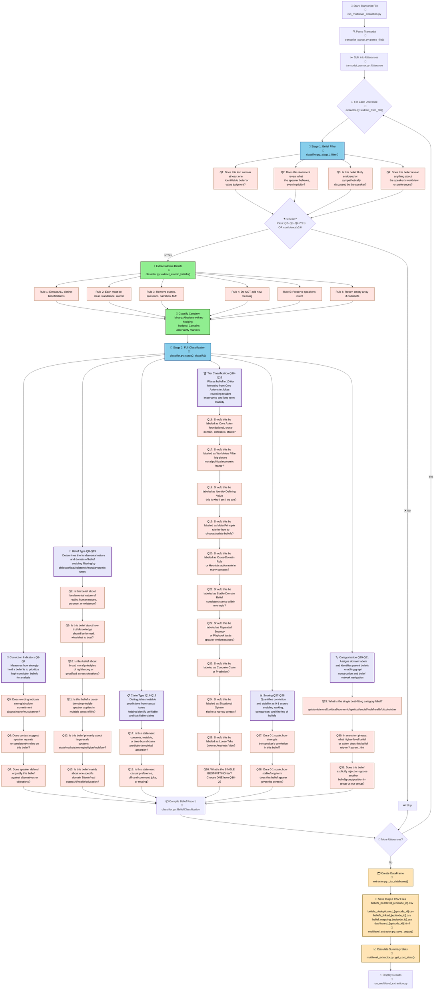

```mermaid
flowchart TD
    Start["📄 Start: Transcript File
    📜 run_multilevel_extraction.py"] --> Parse["🔍 Parse Transcript
    📜 transcript_parser.py::parse_file()"]
    
    Parse --> Split["✂️ Split into Utterances
    📜 transcript_parser.py::Utterance"]
    
    Split --> Loop{"🔄 For Each Utterance
    📜 extractor.py::extract_from_file()"}
    
    Loop --> Filter["🚦 Stage 1: Belief Filter
    📜 classifier.py::stage1_filter()"]
    
    Filter --> Q1["Q1: Does this text contain at least one
    identifiable belief or value judgment?"]
    Filter --> Q2["Q2: Does this statement reveal what
    the speaker believes, even implicitly?"]
    Filter --> Q3["Q3: Is this belief likely endorsed or
    sympathetically discussed by the speaker?"]
    Filter --> Q4["Q4: Does this belief reveal anything about
    the speaker's worldview or preferences?"]
    
    Q1 --> IsBeliefCheck{"❓ Is Belief?
    Pass: Q2+Q3+Q4=YES OR confidence≥0.6"}
    Q2 --> IsBeliefCheck
    Q3 --> IsBeliefCheck
    Q4 --> IsBeliefCheck
    
    IsBeliefCheck -->|"❌ No"| Skip["⏭️ Skip"]
    
    IsBeliefCheck -->|"✅ Yes"| AtomicHeader["⚡ Extract Atomic Beliefs
    📜 classifier.py::extract_atomic_beliefs()"]
    
    AtomicHeader --> Rule1["Rule 1: Extract ALL distinct beliefs/claims"]
    AtomicHeader --> Rule2["Rule 2: Each must be clear, standalone, atomic"]
    AtomicHeader --> Rule3["Rule 3: Remove quotes, questions, narration, fluff"]
    AtomicHeader --> Rule4["Rule 4: Do NOT add new meaning"]
    AtomicHeader --> Rule5["Rule 5: Preserve speaker's intent"]
    AtomicHeader --> Rule6["Rule 6: Return empty array if no beliefs"]
    
    Rule1 --> Certainty["🎯 Classify Certainty
    binary: Absolute with no hedging
    hedged: Contains uncertainty markers"]
    Rule2 --> Certainty
    Rule3 --> Certainty
    Rule4 --> Certainty
    Rule5 --> Certainty
    Rule6 --> Certainty
    
    Certainty --> Stage2Header["🧠 Stage 2: Full Classification
    📜 classifier.py::stage2_classify()"]
    
    Stage2Header --> ConvictionCat["💪 Conviction Indicators Q5-Q7
    Measures how strongly held a belief is to prioritize
    high-conviction beliefs for analysis"]
    Stage2Header --> BeliefTypeCat["🎯 Belief Type Q8-Q13
    Determines the fundamental nature and domain of belief
    enabling filtering by philosophical/epistemic/moral/systemic types"]
    Stage2Header --> ClaimTypeCat["📋 Claim Type Q14-Q15
    Distinguishes testable predictions from casual takes
    helping identify verifiable and falsifiable claims"]
    Stage2Header --> TierCat["🏆 Tier Classification Q16-Q26
    Places belief in 10-tier hierarchy from Core Axioms to Jokes
    revealing relative importance and long-term stability"]
    Stage2Header --> ScoringCat["📊 Scoring Q27-Q28
    Quantifies conviction and stability as 0-1 scores
    enabling ranking, comparison, and filtering of beliefs"]
    Stage2Header --> CategorizationCat["🏷️ Categorization Q29-Q31
    Assigns domain labels and identifies parent beliefs
    enabling graph construction and belief network navigation"]
    
    ConvictionCat --> Q5["Q5: Does wording indicate strong/absolute
    commitment always/never/must/cannot?"]
    Q5 --> Q6["Q6: Does context suggest speaker repeats
    or consistently relies on this belief?"]
    Q6 --> Q7["Q7: Does speaker defend or justify this belief
    against alternatives or objections?"]
    
    BeliefTypeCat --> Q8["Q8: Is this belief about fundamental nature of
    reality, human nature, purpose, or existence?"]
    Q8 --> Q9["Q9: Is this belief about how truth/knowledge
    should be formed, who/what to trust?"]
    Q9 --> Q10["Q10: Is this belief about broad moral principles
    of right/wrong or good/bad across situations?"]
    Q10 --> Q11["Q11: Is this belief a cross-domain principle
    speaker applies in multiple areas of life?"]
    Q11 --> Q12["Q12: Is this belief primarily about large-scale
    systems state/markets/money/religion/tech/law?"]
    Q12 --> Q13["Q13: Is this belief mainly about one specific
    domain Bitcoin/real estate/AI/health/education?"]
    
    ClaimTypeCat --> Q14["Q14: Is this statement concrete, testable,
    or time-bound claim prediction/empirical assertion?"]
    Q14 --> Q15["Q15: Is this statement casual preference,
    offhand comment, joke, or musing?"]
    
    TierCat --> Q16["Q16: Should this be labeled as Core Axiom
    foundational, cross-domain, defended, stable?"]
    Q16 --> Q17["Q17: Should this be labeled as Worldview Pillar
    big-picture moral/political/economic frame?"]
    Q17 --> Q18["Q18: Should this be labeled as Identity-Defining Value
    this is who I am / we are?"]
    Q18 --> Q19["Q19: Should this be labeled as Meta-Principle
    rule for how to choose/update beliefs?"]
    Q19 --> Q20["Q20: Should this be labeled as Cross-Domain Rule
    or Heuristic action rule in many contexts?"]
    Q20 --> Q21["Q21: Should this be labeled as Stable Domain Belief
    consistent stance within one topic?"]
    Q21 --> Q22["Q22: Should this be labeled as Repeated Strategy
    or Playbook tactic speaker endorses/uses?"]
    Q22 --> Q23["Q23: Should this be labeled as Concrete Claim
    or Prediction?"]
    Q23 --> Q24["Q24: Should this be labeled as Situational Opinion
    tied to a narrow context?"]
    Q24 --> Q25["Q25: Should this be labeled as Loose Take
    Joke or Aesthetic Vibe?"]
    Q25 --> Q26["Q26: What is the SINGLE BEST-FITTING tier?
    Choose ONE from Q16-25"]
    
    ScoringCat --> Q27["Q27: On a 0-1 scale, how strong is
    the speaker's conviction in this belief?"]
    Q27 --> Q28["Q28: On a 0-1 scale, how stable/long-term
    does this belief appear given the context?"]
    
    CategorizationCat --> Q29["Q29: What is the single best-fitting category label?
    epistemic/moral/political/economic/spiritual/social/tech/health/bitcoin/other"]
    Q29 --> Q30["Q30: In one short phrase, what higher-level belief
    or axiom does this belief rely on? parent_hint"]
    Q30 --> Q31["Q31: Does this belief explicitly reject or oppose
    another belief/group/position in-group vs out-group?"]
    
    Q7 --> Compile["📦 Compile Belief Record
    📜 classifier.py::BeliefClassification"]
    Q13 --> Compile
    Q15 --> Compile
    Q26 --> Compile
    Q28 --> Compile
    Q31 --> Compile
    
    Compile --> MoreUtterances{"🔁 More Utterances?"}
    MoreUtterances -->|Yes| Loop
    MoreUtterances -->|No| DataFrame["🗂️ Create DataFrame
    📜 extractor.py::_to_dataframe()"]
    
    DataFrame --> SaveOutput["💾 Save Output CSV Files
    beliefs_multilevel_{episode_id}.csv
    beliefs_deduplicated_{episode_id}.csv
    beliefs_linked_{episode_id}.csv
    belief_mapping_{episode_id}.csv
    dashboard_{episode_id}.html
    📜 multilevel_extractor.py::save_output()"]
    
    SaveOutput --> Stats["📈 Calculate Summary Stats
    📜 multilevel_extractor.py::get_cost_stats()"]
    
    Stats --> Display["✨ Display Results
    📜 run_multilevel_extraction.py"]
    
    Skip --> MoreUtterances
    
    classDef newFeature fill:#90EE90,stroke:#2d5016,stroke-width:2px,color:#000
    classDef aiStep fill:#87CEEB,stroke:#104e8b,stroke-width:2px,color:#000
    classDef dataStep fill:#FFE4B5,stroke:#8b6914,stroke-width:2px,color:#000
    classDef questionBox fill:#FFE4E1,stroke:#8b4513,stroke-width:1px,color:#000
    classDef categoryHeader fill:#E6E6FA,stroke:#4B0082,stroke-width:2px,color:#000
    
    class AtomicHeader,Certainty newFeature
    class Filter,Stage2Header aiStep
    class DataFrame,SaveOutput,Stats dataStep
    class Q1,Q2,Q3,Q4,Q5,Q6,Q7,Q8,Q9,Q10,Q11,Q12,Q13,Q14,Q15,Q16,Q17,Q18,Q19,Q20,Q21,Q22,Q23,Q24,Q25,Q26,Q27,Q28,Q29,Q30,Q31,Rule1,Rule2,Rule3,Rule4,Rule5,Rule6 questionBox
    class ConvictionCat,BeliefTypeCat,ClaimTypeCat,TierCat,ScoringCat,CategorizationCat categoryHeader
```
