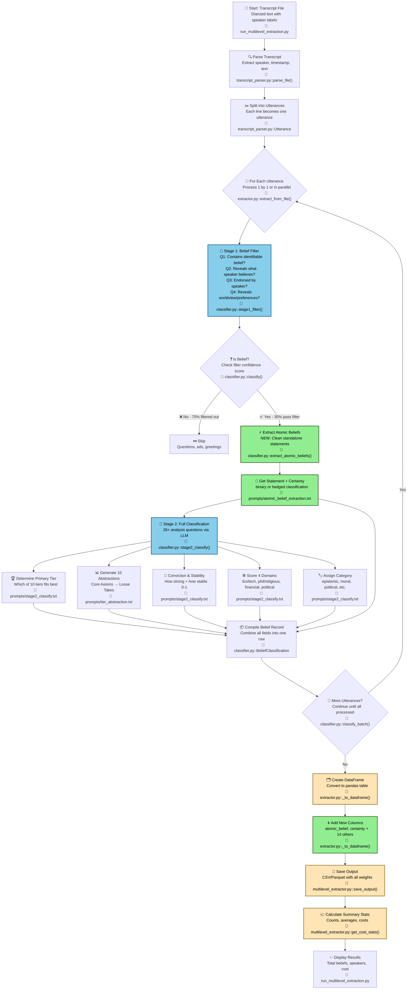

# Belief Extraction Pipeline Flow

This document visualizes the complete belief extraction pipeline, showing how utterances are processed from raw transcript to final belief matrix.

## Pipeline Overview



## Legend

- 🟢 **Green boxes**: New atomic belief extraction features
- 🔵 **Blue boxes**: AI/LLM processing steps (API calls)
- 🟡 **Yellow boxes**: Data transformation steps

## Stage Details

### Stage 1: Belief Filter

Determines if an utterance contains a belief using 4 questions:

1. **Q1**: Contains identifiable belief or value judgment?
2. **Q2**: Reveals what the speaker believes (even implicitly)?
3. **Q3**: Is this belief endorsed or sympathetically discussed by the speaker?
4. **Q4**: Does this reveal anything about the speaker's worldview or preferences?

**Passing criteria**: Q2, Q3, Q4 all YES OR confidence ≥ 0.6

### Atomic Belief Extraction (NEW)

Extracts clean, standalone belief statements from each utterance:
- Removes questions, quotes, narration, fluff
- Preserves speaker's intent and framing
- Classifies certainty: "binary" (absolute) or "hedged" (uncertain)

**Examples:**
- Input: "I think Bitcoin is going to be huge"
  - Atomic: "Bitcoin is going to be huge"
  - Certainty: "hedged"

- Input: "Bitcoin follows a power law, not exponential growth"
  - Atomic: "Bitcoin follows a power law"
  - Certainty: "binary"

### Stage 2: Full Classification

Comprehensive analysis generating:
- **Primary tier** (1-10): Best-fit tier from Core Axioms → Loose Takes
- **10 tier abstractions**: Reformulated at each abstraction level
- **Tier fit scores** (1-10): How well the belief fits each tier
- **Conviction score** (0-1): How strongly speaker holds this belief
- **Stability score** (0-1): How long-term/stable the belief is
- **4 domain scores** (0-1): Scientific/tech, philosophical/religious, financial, political
- **Category**: epistemic, moral, political, economic, etc.

## Final Output Schema

The final CSV/Parquet includes:

| Column | Description |
|--------|-------------|
| `belief_id` | Unique identifier |
| `speaker_id` | Speaker from transcript |
| `episode_id` | Episode identifier |
| `timestamp` | Time in transcript |
| `statement_text` | Original full utterance |
| `atomic_belief` | ✨ Clean standalone statement |
| `certainty` | ✨ "binary" or "hedged" |
| `importance` | Primary tier (1-10) |
| `tier_name` | Tier label |
| `category` | Belief category |
| `conviction_score` | Speaker conviction (0-1) |
| `stability_score` | Long-term stability (0-1) |
| `parent_hint` | Parent belief description |
| `parent_belief_id` | Linked parent ID |

✨ = New atomic belief extraction fields

## Performance

- **Sequential mode**: ~15-20 min for 200 utterances
- **Parallel mode** (10 workers): ~4-6 min for 200 utterances
- **Typical pass rate**: 30% of utterances become beliefs
- **Cost**: ~$0.80-2.50 per full 9k word podcast

## Usage

```bash
# Single-level extraction
python run_multilevel_extraction.py --transcript input.txt --levels 1

# Parallel processing (2-4x faster)
python run_multilevel_extraction.py --transcript input.txt --levels 1 --parallel --max-workers 10

# Test with cheap mode
python run_multilevel_extraction.py --transcript input.txt --levels 1 --cheap-mode --no-wandb

# Multi-level extraction (default)
python run_multilevel_extraction.py --transcript input.txt --episode-id e_001
```

