# Belief Extraction Pipeline Flow

This document visualizes the complete belief extraction pipeline, showing how utterances are processed from raw transcript to final belief matrix.

## Pipeline Overview

```mermaid
flowchart TD
    A["📄 Start: Transcript File
    Diarized text with speaker labels
    📜 run_multilevel_extraction.py"] --> B["🔍 Parse Transcript
    Extract speaker, timestamp, text
    📜 transcript_parser.py::parse_file()"]
    
    B --> C["✂️ Split into Utterances
    Each line becomes one utterance
    📜 transcript_parser.py::Utterance"]
    
    C --> D{"🔄 For Each Utterance
    Process 1 by 1 or in parallel
    📜 extractor.py::extract_from_file()"}
    
    D --> E["🚦 Stage 1: Belief Filter
    Q1: Contains identifiable belief?
    Q2: Reveals what speaker believes?
    Q3: Endorsed by speaker?
    Q4: Reveals worldview/preferences?
    📜 classifier.py::stage1_filter()"]
    
    E --> F{"❓ Is Belief?
    Check filter confidence score
    📜 classifier.py::classify()"}
    
    F -->|"❌ No - 70% filtered out"| G["⏭️ Skip
    Questions, ads, greetings"]
    
    F -->|"✅ Yes - 30% pass filter"| H["⚡ Extract Atomic Beliefs
    Extract ALL distinct beliefs as clean statements
    Remove quotes, questions, fluff
    Preserve speaker's intent
    📜 classifier.py::extract_atomic_beliefs()"]
    
    H --> I["🎯 Classify Certainty
    binary: absolute statements
    hedged: contains uncertainty markers
    📜 prompts/atomic_belief_extraction.txt"]
    
    I --> J["🧠 Stage 2: Full Classification
    Q5-7: Conviction indicators
    Q8-13: Belief type classification
    Q14-15: Claim type
    Q16-26: Tier determination
    Q27-28: Scoring
    Q29-31: Categorization
    📜 classifier.py::stage2_classify()"]
    
    J --> K["🏆 Determine Primary Tier Q16-26
    Core Axiom? Worldview Pillar?
    Identity Value? Meta-Principle?
    Cross-Domain Rule? Domain Belief?
    Strategy? Claim? Opinion? Joke?
    📜 prompts/stage2_classify.txt"]
    J --> L["📊 Generate 10 Abstractions
    Rewrite belief at each tier level
    Tier 1 Core Axioms → Tier 10 Loose Takes
    📜 prompts/tier_abstraction.txt"]
    J --> M["💪 Conviction & Stability Q27-28
    Q27: How strong is conviction? 0-1
    Q28: How stable/long-term? 0-1
    📜 prompts/stage2_classify.txt"]
    J --> N["🌐 Score 4 Domains
    Scientific/tech, philosophical/religious
    Financial, political 0-1 each
    📜 prompts/stage2_classify.txt"]
    J --> O["🏷️ Assign Category Q29-31
    Q29: epistemic, moral, political, etc.
    Q30: Parent hint higher-level belief
    Q31: Defines outgroup? yes/no
    📜 prompts/stage2_classify.txt"]
    
    K --> P["📦 Compile Belief Record
    Combine all fields into one row
    📜 classifier.py::BeliefClassification"]
    L --> P
    M --> P
    N --> P
    O --> P
    I --> P
    
    P --> Q{"🔁 More Utterances?
    Continue until all processed
    📜 classifier.py::classify_batch()"}
    
    Q -->|Yes| D
    Q -->|No| R["🗂️ Create DataFrame
    Convert to pandas table
    📜 extractor.py::_to_dataframe()"]
    
    R --> S["➕ Add New Columns
    atomic_belief, certainty + 14 others
    📜 extractor.py::_to_dataframe()"]
    
    S --> T["💾 Save Output
    CSV/Parquet with all weights
    📜 multilevel_extractor.py::save_output()"]
    
    T --> U["📈 Calculate Summary Stats
    Counts, averages, costs
    📜 multilevel_extractor.py::get_cost_stats()"]
    
    U --> V["✨ Display Results
    Total beliefs, speakers, cost
    📜 run_multilevel_extraction.py"]
    
    classDef newFeature fill:#90EE90,stroke:#2d5016,stroke-width:2px,color:#000
    classDef aiStep fill:#87CEEB,stroke:#104e8b,stroke-width:2px,color:#000
    classDef dataStep fill:#FFE4B5,stroke:#8b6914,stroke-width:2px,color:#000
    
    class H,I,S newFeature
    class E,J aiStep
    class R,T,U dataStep
```



## Legend

- 🟢 **Green boxes**: New atomic belief extraction features
- 🔵 **Blue boxes**: AI/LLM processing steps (API calls)
- 🟡 **Yellow boxes**: Data transformation steps

## Stage Details

### Stage 1: Belief Filter

Determines if an utterance contains a belief using 4 questions:

1. **Q1**: Contains identifiable belief or value judgment?
2. **Q2**: Reveals what the speaker believes (even implicitly)?
3. **Q3**: Is this belief endorsed or sympathetically discussed by the speaker?
4. **Q4**: Does this reveal anything about the speaker's worldview or preferences?

**Passing criteria**: Q2, Q3, Q4 all YES OR confidence ≥ 0.6

### Atomic Belief Extraction (NEW)

Extracts clean, standalone belief statements from each utterance:
- Removes questions, quotes, narration, fluff
- Preserves speaker's intent and framing
- Classifies certainty: "binary" (absolute) or "hedged" (uncertain)

**Examples:**
- Input: "I think Bitcoin is going to be huge"
  - Atomic: "Bitcoin is going to be huge"
  - Certainty: "hedged"

- Input: "Bitcoin follows a power law, not exponential growth"
  - Atomic: "Bitcoin follows a power law"
  - Certainty: "binary"

### Stage 2: Full Classification

Comprehensive 27-question analysis (Q5-Q31):

**Conviction Indicators (Q5-7):**
- Q5: Strong/absolute commitment wording? ("always/never/must")
- Q6: Speaker repeats or consistently relies on this?
- Q7: Speaker defends/justifies against alternatives?

**Belief Type (Q8-13):**
- Q8: About fundamental nature of reality/existence?
- Q9: About truth/knowledge formation, trust, evaluation?
- Q10: About broad moral principles (right/wrong)?
- Q11: Cross-domain principle applied in multiple areas?
- Q12: About large-scale systems/institutions?
- Q13: Mainly about one specific domain?

**Claim Type (Q14-15):**
- Q14: Concrete, testable, time-bound claim?
- Q15: Casual preference, joke, or musing?

**Tier Classification (Q16-26):**
- Q16: Core Axiom? (foundational, cross-domain, defended)
- Q17: Worldview Pillar? (big-picture frame)
- Q18: Identity-Defining Value? ("this is who I am")
- Q19: Meta-Principle? (rule for updating beliefs)
- Q20: Cross-Domain Rule/Heuristic?
- Q21: Stable Domain Belief? (consistent stance in one topic)
- Q22: Repeated Strategy/Playbook?
- Q23: Concrete Claim/Prediction?
- Q24: Situational Opinion? (narrow context)
- Q25: Loose Take/Joke/Aesthetic?
- Q26: Single best-fitting tier?

**Scoring (Q27-28):**
- Q27: Conviction score (0-1): How strongly held?
- Q28: Stability score (0-1): How long-term/stable?

**Categorization (Q29-31):**
- Q29: Category (epistemic, moral, political, economic, etc.)
- Q30: Parent hint (higher-level belief this relies on)
- Q31: Defines outgroup? (rejects another belief/group)

## Final Output Schema

The final CSV/Parquet includes:

| Column | Description |
|--------|-------------|
| `belief_id` | Unique identifier |
| `speaker_id` | Speaker from transcript |
| `episode_id` | Episode identifier |
| `timestamp` | Time in transcript |
| `statement_text` | Original full utterance |
| `atomic_belief` | ✨ Clean standalone statement |
| `certainty` | ✨ "binary" or "hedged" |
| `importance` | Primary tier (1-10) |
| `tier_name` | Tier label |
| `category` | Belief category |
| `conviction_score` | Speaker conviction (0-1) |
| `stability_score` | Long-term stability (0-1) |
| `parent_hint` | Parent belief description |
| `parent_belief_id` | Linked parent ID |

✨ = New atomic belief extraction fields

## Performance

- **Sequential mode**: ~15-20 min for 200 utterances
- **Parallel mode** (10 workers): ~4-6 min for 200 utterances
- **Typical pass rate**: 30% of utterances become beliefs
- **Cost**: ~$0.80-2.50 per full 9k word podcast

## Usage

```bash
# Single-level extraction
python run_multilevel_extraction.py --transcript input.txt --levels 1

# Parallel processing (2-4x faster)
python run_multilevel_extraction.py --transcript input.txt --levels 1 --parallel --max-workers 10

# Test with cheap mode
python run_multilevel_extraction.py --transcript input.txt --levels 1 --cheap-mode --no-wandb

# Multi-level extraction (default)
python run_multilevel_extraction.py --transcript input.txt --episode-id e_001
```

