# Belief Extraction Pipeline Flow

This document visualizes the complete belief extraction pipeline, showing how utterances are processed from raw transcript to final belief matrix.

## Pipeline Overview

```mermaid
flowchart TD
    A["📄 Start: Transcript File
    Diarized text with speaker labels
    📜 run_multilevel_extraction.py"] --> B["🔍 Parse Transcript
    Extract speaker, timestamp, text
    📜 transcript_parser.py::parse_file()"]
    
    B --> C["✂️ Split into Utterances
    Each line becomes one utterance
    📜 transcript_parser.py::Utterance"]
    
    C --> D{"🔄 For Each Utterance
    Process 1 by 1 or in parallel
    📜 extractor.py::extract_from_file()"}
    
    D --> E["🚦 Stage 1: Belief Filter
    Q1: Contains identifiable belief?
    Q2: Reveals what speaker believes?
    Q3: Endorsed by speaker?
    Q4: Reveals worldview/preferences?
    📜 classifier.py::stage1_filter()"]
    
    E --> F{"❓ Is Belief?
    Check filter confidence score
    📜 classifier.py::classify()"}
    
    F -->|"❌ No - 70% filtered out"| G["⏭️ Skip
    Questions, ads, greetings"]
    
    F -->|"✅ Yes - 30% pass filter"| H["⚡ Extract Atomic Beliefs
    Extract ALL distinct beliefs as clean statements
    Remove quotes, questions, fluff
    Preserve speaker's intent
    📜 classifier.py::extract_atomic_beliefs()"]
    
    H --> I["🎯 Classify Certainty
    binary: absolute statements
    hedged: contains uncertainty markers
    📜 prompts/atomic_belief_extraction.txt"]
    
    I --> J["🧠 Stage 2: Full Classification
    Q5-7: Conviction indicators
    Q8-13: Belief type classification
    Q14-15: Claim type
    Q16-26: Tier determination
    Q27-28: Scoring
    Q29-31: Categorization
    📜 classifier.py::stage2_classify()"]
    
    J --> K["🏆 Determine Primary Tier Q16-26
    Core Axiom? Worldview Pillar?
    Identity Value? Meta-Principle?
    Cross-Domain Rule? Domain Belief?
    Strategy? Claim? Opinion? Joke?
    📜 prompts/stage2_classify.txt"]
    J --> L["📊 Generate 10 Abstractions
    Rewrite belief at each tier level
    Tier 1 Core Axioms → Tier 10 Loose Takes
    📜 prompts/tier_abstraction.txt"]
    J --> M["💪 Conviction & Stability Q27-28
    Q27: How strong is conviction? 0-1
    Q28: How stable/long-term? 0-1
    📜 prompts/stage2_classify.txt"]
    J --> N["🌐 Score 4 Domains
    Scientific/tech, philosophical/religious
    Financial, political 0-1 each
    📜 prompts/stage2_classify.txt"]
    J --> O["🏷️ Assign Category Q29-31
    Q29: epistemic, moral, political, etc.
    Q30: Parent hint higher-level belief
    Q31: Defines outgroup? yes/no
    📜 prompts/stage2_classify.txt"]
    
    K --> P["📦 Compile Belief Record
    Combine all fields into one row
    📜 classifier.py::BeliefClassification"]
    L --> P
    M --> P
    N --> P
    O --> P
    I --> P
    
    P --> Q{"🔁 More Utterances?
    Continue until all processed
    📜 classifier.py::classify_batch()"}
    
    Q -->|Yes| D
    Q -->|No| R["🗂️ Create DataFrame
    Convert to pandas table
    📜 extractor.py::_to_dataframe()"]
    
    R --> S["➕ Add New Columns
    atomic_belief, certainty + 14 others
    📜 extractor.py::_to_dataframe()"]
    
    S --> T["💾 Save Output
    CSV/Parquet with all weights
    📜 multilevel_extractor.py::save_output()"]
    
    T --> U["📈 Calculate Summary Stats
    Counts, averages, costs
    📜 multilevel_extractor.py::get_cost_stats()"]
    
    U --> V["✨ Display Results
    Total beliefs, speakers, cost
    📜 run_multilevel_extraction.py"]
    
    classDef newFeature fill:#90EE90,stroke:#2d5016,stroke-width:2px,color:#000
    classDef aiStep fill:#87CEEB,stroke:#104e8b,stroke-width:2px,color:#000
    classDef dataStep fill:#FFE4B5,stroke:#8b6914,stroke-width:2px,color:#000
    
    class H,I,S newFeature
    class E,J aiStep
    class R,T,U dataStep
```



## Legend

- 🟢 **Green boxes**: New atomic belief extraction features
- 🔵 **Blue boxes**: AI/LLM processing steps (API calls)
- 🟡 **Yellow boxes**: Data transformation steps

## Stage Details

### Stage 1: Belief Filter

Determines if an utterance contains a belief using 4 questions (exact LLM prompts):

**Q1**: Does this text contain at least one identifiable belief or value judgment? (yes/no)
- NO if it's purely logistical (ads, greetings, timestamps, housekeeping)
- YES if it expresses any opinion, evaluation, or preference - even if also contains questions or fragments

**Q2**: Does this statement reveal what the speaker believes, even implicitly? (yes/no)
- NO if it's pure factual narration with no evaluative language
- YES if it contains ANY opinion, evaluation, preference, or implied stance
- YES for rhetorical questions that reveal beliefs ("Isn't X obviously wrong?")

**Q3**: Is this belief likely endorsed or sympathetically discussed by the speaker? (yes/no)
- NO if speaker is explicitly disagreeing or neutrally reporting facts
- YES if speaker seems to agree, sympathize, or present favorably
- YES even if not explicitly saying "I believe" - tone and context matter

**Q4**: Does this belief reveal anything about the speaker's worldview or preferences? (yes/no)
- NO if it's purely procedural (ads, "welcome to the show", time checks)
- YES if it shows ANY preference, taste, opinion, or interpretive stance
- YES even for casual preferences ("I like coffee") or aesthetic judgments

**Passing criteria**: Q2, Q3, Q4 all YES OR confidence ≥ 0.6

### Atomic Belief Extraction (NEW)

Exact LLM instructions:

**Task**: Extract ALL distinct beliefs/claims as atomic statements - clean, standalone, declarative statements that represent what the speaker believes or claims.

**RULES:**
1. Extract ALL distinct beliefs/claims from the statement
2. Each belief must be a clear, standalone, atomic statement
3. Remove quotes, questions, narration, or fluff
4. Do NOT add new meaning or interpretation
5. Preserve the speaker's intent and framing
6. If no beliefs are present, return empty array

**CERTAINTY CLASSIFICATION:**
- **"binary"**: Absolute statement with no hedging ("Bitcoin is...", "X will happen")
- **"hedged"**: Contains uncertainty markers ("might", "could", "probably", "I think")

**Examples:**
- Input: "I think Bitcoin is going to be huge and it might replace the dollar someday."
  - Output: [
      {"belief": "Bitcoin is going to be huge", "certainty": "hedged"},
      {"belief": "Bitcoin might replace the dollar", "certainty": "hedged"}
    ]

- Input: "Bitcoin follows a power law, not exponential growth."
  - Output: [
      {"belief": "Bitcoin follows a power law", "certainty": "binary"},
      {"belief": "Bitcoin does not follow exponential growth", "certainty": "binary"}
    ]

- Input: "What time is the conference?"
  - Output: []

### Stage 2: Full Classification

Comprehensive 27-question analysis (Q5-Q31) - exact LLM prompts:

**=== CONVICTION INDICATORS (Q5-7) ===**

**Q5**: Does the wording indicate strong or absolute commitment (e.g., "always/never/must/cannot")? (yes/no)

**Q6**: Does the surrounding context suggest the speaker repeats or consistently relies on this belief? (yes/no)

**Q7**: Does the speaker defend or justify this belief against alternatives or objections? (yes/no)

**=== BELIEF TYPE (Q8-13) ===**

**Q8**: Is this belief about the fundamental nature of reality, human nature, purpose, or the structure of existence? (yes/no)

**Q9**: Is this belief about how truth/knowledge should be formed, who/what to trust, or how to evaluate information? (yes/no)

**Q10**: Is this belief about broad moral principles of right/wrong or good/bad that apply across many situations? (yes/no)

**Q11**: Is this belief a cross-domain principle or rule the speaker applies in multiple areas of life? (yes/no)

**Q12**: Is this belief primarily about large-scale systems/institutions (state, markets, money, religion, tech, law, etc.) that shapes many of their views? (yes/no)

**Q13**: Is this belief mainly about one specific domain (e.g., Bitcoin, real estate, AI, health, education, geopolitics)? (yes/no)

**=== CLAIM TYPE (Q14-15) ===**

**Q14**: Is this statement a concrete, testable, or time-bound claim (prediction, number, causal claim, empirical assertion)? (yes/no)

**Q15**: Is this statement best interpreted as a casual preference, offhand comment, joke, brand line, or exploratory musing? (yes/no)

**=== TIER CLASSIFICATION (Q16-26) ===**

**Q16**: Should this be labeled as a **Core Axiom** (foundational, cross-domain, defended, stable)? (yes/no)

**Q17**: Should this be labeled as a **Worldview Pillar** (big-picture moral/political/economic/epistemic/spiritual frame)? (yes/no)

**Q18**: Should this be labeled as an **Identity-Defining Value** ("this is who I am / we are")? (yes/no)

**Q19**: Should this be labeled as a **Meta-Principle** (rule for how to choose/update beliefs)? (yes/no)

**Q20**: Should this be labeled as a **Cross-Domain Rule or Heuristic** (action rule used in many contexts)? (yes/no)

**Q21**: Should this be labeled as a **Stable Domain Belief** (consistent stance within one topic)? (yes/no)

**Q22**: Should this be labeled as a **Repeated Strategy or Playbook** (tactic the speaker endorses/uses)? (yes/no)

**Q23**: Should this be labeled as a **Concrete Claim or Prediction**? (yes/no)

**Q24**: Should this be labeled as a **Situational Opinion tied to a narrow context**? (yes/no)

**Q25**: Should this be labeled as a **Loose Take / Joke / Aesthetic Vibe**? (yes/no)

**Q26**: What is the SINGLE BEST-FITTING tier? (choose ONE from Q16-25)

**=== SCORING (Q27-28) ===**

**Q27**: On a 0–1 scale, how strong is the speaker's conviction in this belief? (0.0-1.0)

**Q28**: On a 0–1 scale, how stable/long-term does this belief appear given the context? (0.0-1.0)

**=== CATEGORIZATION (Q29-31) ===**

**Q29**: What is the single best-fitting category label for this belief?
(Choose ONE: epistemic, moral, political, economic, spiritual, social, tech, health, bitcoin/finance, other)

**Q30**: In one short phrase, what higher-level belief or axiom does this belief most likely instantiate or rely on?
(This is the "parent_hint" - leave empty if this seems foundational)

**Q31**: Does this belief explicitly reject or oppose another belief/group/position (i.e., define an in-group vs out-group)? (yes/no)

## Final Output Schema

The final CSV/Parquet includes:

| Column | Description |
|--------|-------------|
| `belief_id` | Unique identifier |
| `speaker_id` | Speaker from transcript |
| `episode_id` | Episode identifier |
| `timestamp` | Time in transcript |
| `statement_text` | Original full utterance |
| `atomic_belief` | ✨ Clean standalone statement |
| `certainty` | ✨ "binary" or "hedged" |
| `importance` | Primary tier (1-10) |
| `tier_name` | Tier label |
| `category` | Belief category |
| `conviction_score` | Speaker conviction (0-1) |
| `stability_score` | Long-term stability (0-1) |
| `parent_hint` | Parent belief description |
| `parent_belief_id` | Linked parent ID |

✨ = New atomic belief extraction fields

## Performance

- **Sequential mode**: ~15-20 min for 200 utterances
- **Parallel mode** (10 workers): ~4-6 min for 200 utterances
- **Typical pass rate**: 30% of utterances become beliefs
- **Cost**: ~$0.80-2.50 per full 9k word podcast

## Usage

```bash
# Single-level extraction
python run_multilevel_extraction.py --transcript input.txt --levels 1

# Parallel processing (2-4x faster)
python run_multilevel_extraction.py --transcript input.txt --levels 1 --parallel --max-workers 10

# Test with cheap mode
python run_multilevel_extraction.py --transcript input.txt --levels 1 --cheap-mode --no-wandb

# Multi-level extraction (default)
python run_multilevel_extraction.py --transcript input.txt --episode-id e_001
```

